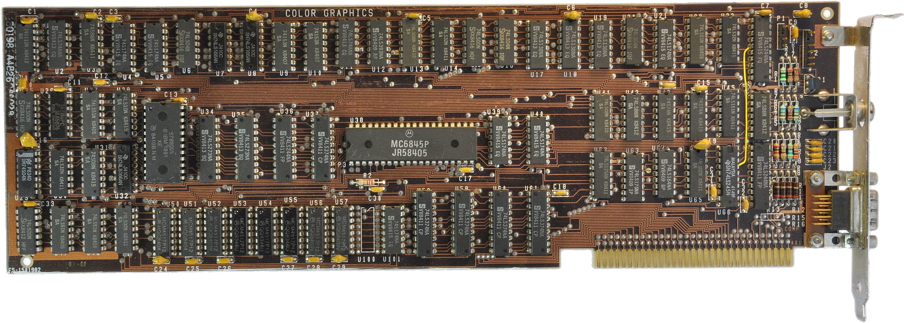

# IBM Colour Graphics Adapter (CGA) Schematics

This is a redrawing in KiCad of the original IBM CGA card schematics.
I intend to use these to help me repair original boards and build a clone.

Original picture under CC BY-SA 4.0, found [here](https://en.wikipedia.org/wiki/Color_Graphics_Adapter#/media/File:IBM_Color_Graphics_Adapter.jpg)

## WARNING

This schematic has not yet been verified, it could (and, I'm sure, will) contain errors!
**Help in double checking** and finding issues is appreciated: you can find the original manual [here](docs/Color_Graphics_Adapter_-_Manual.pdf), 
see pages 32-37.

