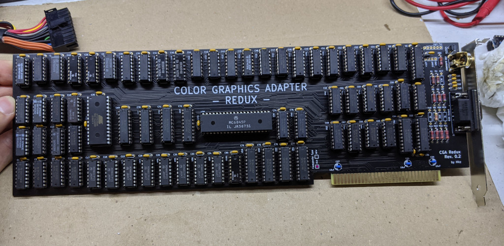

# Color Graphics Adapter - Redux

## Introduction

**WARNING:** This card is still undergoing basic testing!

The Color Graphics Adapter (**CGA**) Redux board is a more or less faithful clone of the original IBM CGA, based on the original schematics.

### Disclaimer

I take NO responsibility for what happens if you decide to build and use this card. Your computer might crash, catch fire or be destroyed in other nasty ways.
You're encourauged to take what you deem fit from this, and use it in your projects!

## Bill of Materials

**TODO**

### Character ROM

This board needs a character ROM to work. I would advise to search for a dump of IBM P/N 5788005, concatenate it four times and burn it on a 27C256

## Known issues

### Rev 0

* The Composite video out has an inverted connection for that type of footprint. (fixed in rev 0.1)
* Silkscreen for U28 says 74LS10, but it's actually an 74S10 on an original board (fixed in rev 0.1)
* traces that connect the edge to the power planes for 5V and GND are a bit too thin for my taste (fixed in rev 0.1)

